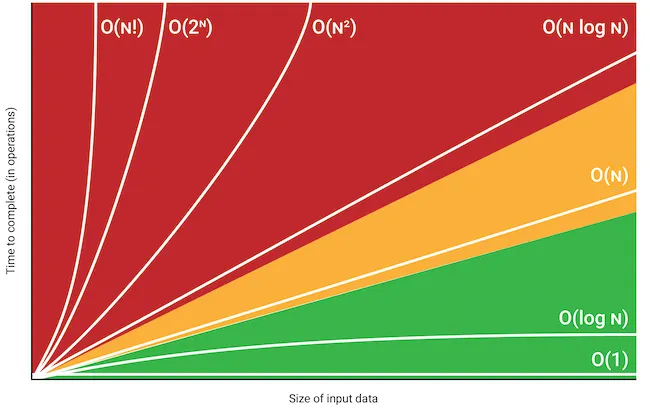

# LeetCode Problem-Solving Patterns

This repository contains a **collection of the most common patterns** used to solve LeetCode problems efficiently.  
Each pattern includes:
- When to use it
- A representative problem
- Input/Output example
- An optimized Python solution (best possible **time/space complexity**)
- Step-by-step explanation of the approach

---

## 📚 Patterns Index

| #  | Pattern | Typical Use Case | Example Problem |
|----|---------|------------------|-----------------|
| 1  | [Two Pointers](patterns/%231-two-pointers.md) | Sorted arrays, palindromes, target sums | Two Sum II |
| 2  | [Sliding Window](patterns/%232-sliding-window.md) | Subarrays/substrings with constraints | Longest Substring Without Repeating Characters |
| 3  | [Fast & Slow Pointers](patterns/%233-fast--slow-pointers-floyds-cycle.md) | Detect cycles, find middle node | Linked List Cycle II |
| 4  | [Binary Search](patterns/%234-binary-search.md) | Sorted arrays, monotonic conditions | Find First and Last Position of Element |
| 5  | [Backtracking / DFS](patterns/%235-backtracking--dfs.md) | Subsets, permutations, combinations | Subsets |
| 6  | [Breadth-First Search (BFS)](patterns/%236-bfs-breadth-first-search.md) | Level-order traversal, shortest paths | Binary Tree Level Order Traversal |
| 7  | [Dynamic Programming (DP)](patterns/%237-dynamic-programming.md) | Optimization with overlapping subproblems | House Robber |
| 8  | [Hash Tables](patterns/%238-hash-table-dictionaries--maps.md) | Fast lookup, complement check | Two Sum |
| 9  | [Monotonic Stack](patterns/%239-stack--monotonic-stack.md) | Next greater/smaller elements | Daily Temperatures |
| 10 | [Heap / Priority Queue](patterns/%2310-heap--priority-queue.md) | Top-k, merging sorted lists | Kth Largest Element |
| 11 | [Union-Find (DSU)](patterns/%2311-union-find--disjoint-set-dsu.md) | Connected components, cycle detection | Connected Components in Graph |
| 12 | [Trie (Prefix Tree)](patterns/%2312-prefix-tree.md) | Prefix search, autocomplete | Implement Trie |
| 13 | [Bit Manipulation](patterns/%2313-bit-manipulation-operations-bitwise.md) | Unique elements, subset states | Single Number |

## Guide

[Leetcode Pattern Recognition Guide](guides/Leetcode_Pattern_Recognition_Guide_PT.md)

[Leetcode Pattern Recognition Guide PDF](guides/Leetcode_Pattern_Recognition_Guide_PT.pdf)

---

## Big O Notation



---

## 🚀 Example: Two Pointers

**Problem:** Two Sum II (input sorted)  
- **Input:** `numbers = [2,7,11,15], target = 9`  
- **Output:** `[1,2]` (1-based indices)

```python
def two_sum_sorted(numbers, target):
    l, r = 0, len(numbers) - 1
    while l < r:
        s = numbers[l] + numbers[r]
        if s == target:
            return [l+1, r+1]
        if s < target:
            l += 1
        else:
            r -= 1
    return [-1, -1]
```
- **Time Complexity:** `O(n)`  
- **Space Complexity:** `O(1)`

### Step-by-step
1. Start with two pointers (`l` at beginning, `r` at end).
2. Check the sum:
   - If equal → return indices.  
   - If less → move `l` right.  
   - If greater → move `r` left.  
3. Continue until they meet.

---

## 🧩 Other Patterns

Each pattern in this repo follows the same structure:
- **When to use**
- **Problem statement with I/O**
- **Optimized Python code**
- **Complexity analysis**
- **Step-by-step explanation**

---

## 🏆 Goal

The goal of this repository is to:
- Provide a **practical reference** for mastering LeetCode patterns.
- Help developers **recognize problem types** quickly.
- Offer **clean, optimized Python implementations**.

---

## 💡 Contributing

Feel free to:
- Add new problems under existing patterns.
- Suggest improvements in code or explanations.
- Submit pull requests with additional patterns.
